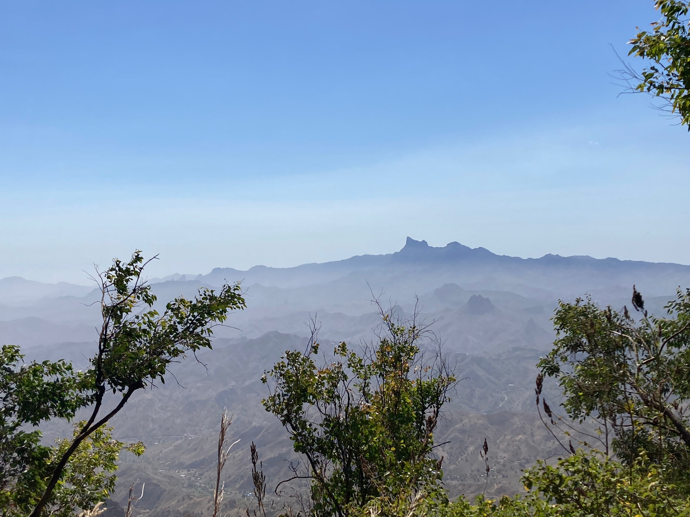

> Pensei na frequência do pensar,
veloz, ininterrupto e profundo, 
um comboio infindável,
sobre o (s) proposito (s), o ser,
a vida.
>
> Na fragilidade do ser,
da nossa antropocentria esquizofrenica,
que nos faz vibrar num centro giratório gravitacional, 
procurei os porquês.
>
> Talvez, não hajam certas respostas,
neste universo, onde o mar lava as nossas almas,
depois da terra nos expelir e, no fim, nos engolir.
>
> É, se calhar, complicar o simples,
simplificar o complexo, 
nas sinfonias dos anniversarius dos seres,
onde mergulho para renascer. 
---

_Parque Natural Serra Malagueta_

